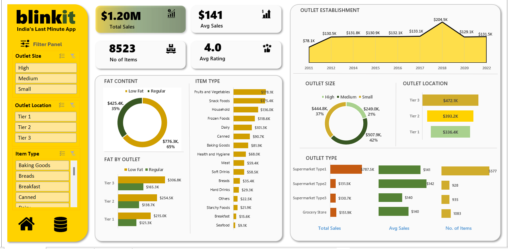

# Blinkit Excel Dashboard 📊

This project presents a comprehensive sales analysis of Blinkit using Microsoft Excel. It includes interactive pivot tables, charts, and a dynamic dashboard to visualize key metrics.

## 🔍 Key Insights & KPIs

### 📌 KPIs:
- Total Sum of Sales
- Average of Sales
- Number of Items
- Average of Rating

### 📈 Visual Analysis:
- Total Sales by Fat Content
- Fat Content by Outlet (for Total Sales)
- Total Sales by Item Type
- Total Sales by Outlet Establishment Year
- Total Sales by Outlet Size
- Total Sales by Outlet Location
- Total Sales, Average Sales, and Number of Items by Outlet Type

## 🎛 Slicers Used
- Outlet Size
- Outlet Location
- Item Type

## 🛠 Tools Used

- Microsoft Excel
- Pivot Tables and Charts
- Slicers for Interactivity

## 📸 Dashboard Preview

Feel free to explore the Excel file for a detailed view of the analysis.
