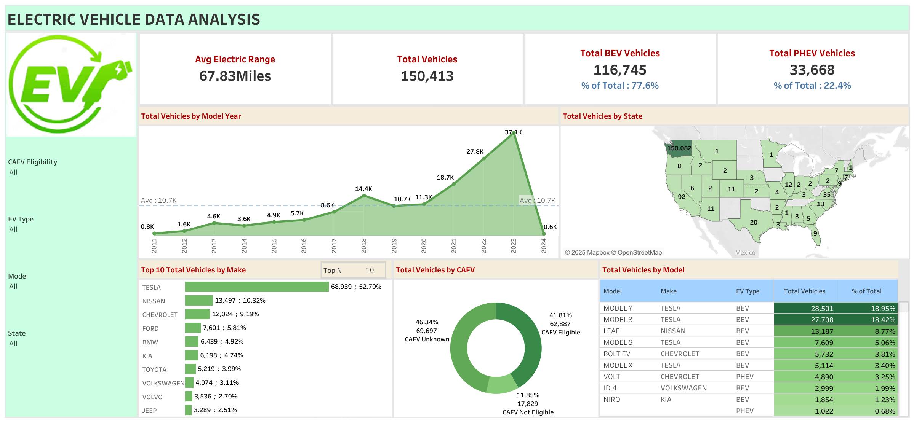

# ⚡ Electric Vehicle Population Dashboard

This Tableau dashboard provides a comprehensive analysis of electric vehicle (EV) population data in the United States. It offers key insights into vehicle distribution, manufacturer dominance, geographical trends, and the impact of fuel incentives.

---

## 📊 KPIs Included

1. **Total Vehicles**  
   Displays the total number of electric vehicles in the dataset.

2. **Average Electric Range**  
   Calculates the average electric driving range across all vehicles.

3. **Total BEV Vehicles and % of Total**  
   Shows the count and percentage of Battery Electric Vehicles (BEVs).

4. **Total PHEV Vehicles and % of Total**  
   Shows the count and percentage of Plug-in Hybrid Electric Vehicles (PHEVs).

---

## 📈 Visualizations

1. **Total Vehicles by Model Year (From 2010 Onwards)**  
   A line/area chart that illustrates the distribution of EVs over the years, providing insights into growth trends and adoption patterns.

2. **Total Vehicles by State**  
   A map chart that shows the geographical distribution of EVs across states, highlighting regions with higher adoption.

3. **Top 10 Total Vehicles by Make**  
   A bar chart highlighting the top 10 EV manufacturers based on vehicle count, offering insight into brand dominance.

4. **Total Vehicles by CAFV Eligibility**  
   A pie/donut chart that shows the share of EVs eligible for Clean Alternative Fuel Vehicle (CAFV) incentives, helping understand policy impact.

5. **Top 10 Total Vehicles by Model**  
   A treemap visualizing the most popular EV models based on total vehicle count, revealing consumer preferences.

---

## 🧰 Tools Used

- **Tableau Public**
- **CSV Dataset from Kaggle**
- **Excel** (for basic data cleaning)

---

## 🖼️ Dashboard Preview

---

Feel free to fork, explore, and build on this project!
